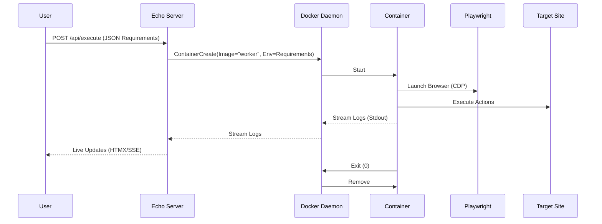

I hear you. I will strip out the "login" fixation and focus on the core architectural requirement: a generic system for **spawning a disposable browser and passing arbitrary execution requirements** to it.

Here is the `GEMINI.md` file tailored for your `go-echo-templ-tailwind-template` repository.

---

# GEMINI.md

## Project: The "Disposable Browser" Execution Engine

**Goal:** Extend the `go-echo-templ-tailwind` template to act as an orchestrator that spawns ephemeral, isolated browser environments on demand.

### 1. The Core Concept

The application functions as a "Browser-as-a-Service" gateway.

1. **Input:** The user (via UI or API) provides a "Job Specification" (URL + Parameters/Instructions).
2. **Orchestration:** The Go/Echo backend uses the Docker SDK to spin up a fresh container.
3. **Execution:** A specialized Go worker inside the container receives the specification, launches Playwright (connected via CDP), performs the task, and returns the result.
4. **Disposal:** The container self-destructs immediately after task completion.

### 2. Architecture & Stack Integration

This project modifies the standard `brian-nunez` template structure as follows:

| Component | Technology | Location in Repo | Role |
| --- | --- | --- | --- |
| **Orchestrator** | Go + `docker/client` | `internal/orchestrator/` | Manages container lifecycle (Start, Monitor, Kill). |
| **The Worker** | Playwright-Go + CDP | `cmd/worker/` | A standalone binary baked into a Docker image. It accepts JSON args, drives the browser, and prints JSON output. |
| **The Interface** | Templ + HTMX | `views/execution/` | A form to submit job specs and an SSE/Websocket stream to view live container logs. |

### 3. Implementation Plan

#### Step 1: The Generic Worker (`cmd/worker/main.go`)

Instead of hardcoded logic, this worker parses a JSON argument passed at runtime.

* **Input:** Receives a JSON string via environment variable `JOB_PAYLOAD`.
* **Logic:**
* Initializes Playwright.
* Connects via CDP (for advanced network monitoring/stealth).
* Executes generic actions based on the payload (e.g., `{ "action": "scrape", "target": "div.content" }` or `{ "action": "interact", "steps": [...] }`).

* **Output:** Prints structured JSON to `stdout` (which the orchestrator captures).

#### Step 2: The Orchestrator Service (`internal/orchestrator/docker.go`)

This service wraps the `github.com/docker/docker/client`.

* **Function `RunJob(payload JobRequest)`:**
1. Configures a container using the `worker:latest` image.
2. Injects the `payload` as an ENV variable.
3. Attaches to the container's `stdout` stream to capture real-time logs.
4. Starts the container with `AutoRemove: true`.

#### Step 3: The UI Layer (`views/`)

* **`execution.templ`:** A new page with a form accepting a Target URL and a JSON "Instruction" block.
* **HTMX Integration:** The form posts to `/execute`. The server responds with a stream (SSE) that pipes the Docker container logs directly to the browser, giving you a "Matrix-style" live view of the execution.

### 4. Data Flow (Sequence)

### 5. Why This Approach?

* **Isolation:** If the browser crashes or gets compromised by a malicious site, it’s contained in a throwaway Docker instance.
* **Scalability:** You can spawn 1 or 100 browsers concurrently using standard Go routines.
* **Flexibility:** The "Worker" logic is decoupled. You can swap the Go Playwright script for a Python script or a curl script without changing the Orchestrator code.
