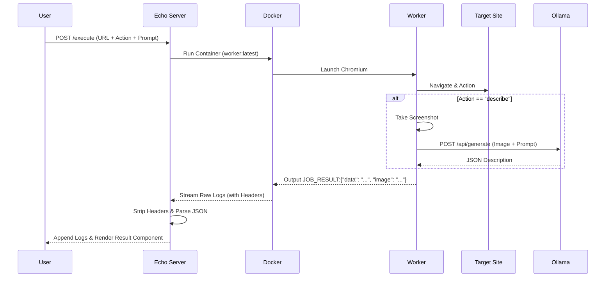

# GEMINI.md

## Project: The "Disposable Browser" Execution Engine

**Goal:** A high-performance, isolated system for spawning ephemeral browser environments to perform automated tasks (scraping, AI-driven visual analysis) with real-time feedback.

### 1. The Core Concept

The application serves as a "Browser-as-a-Service" gateway.

1.  **Input:** User provides a Target URL, an Action, and an optional custom Prompt.
2.  **Orchestration:** The Go/Echo backend spawns a fresh Docker container.
3.  **Execution:** A specialized Go worker inside the container launches Playwright, performs the task (with optional Ollama/Gemma integration), and returns a structured result.
4.  **Disposal:** The container self-destructs immediately after task completion (`AutoRemove: true`).

### 2. Architecture & Stack Integration

| Component | Technology | Location | Role |
| :--- | :--- | :--- | :--- |
| **Orchestrator** | Go + `moby/client` | `internal/orchestrator/` | Manages container lifecycle and log streaming. |
| **The Worker** | Playwright-Go + Ollama | `cmd/worker/` | A standalone binary that drives the browser and calls AI APIs. |
| **The Interface** | Templ + HTMX + JS | `views/execution/` | Interactive UI with dynamic form fields and real-time terminal. |
| **AI Integration** | Ollama (Gemma 3:4b) | External (10.0.0.115) | Provides visual description of the page via screenshots. |

### 3. Key Features

#### 🛡️ Secure Isolation
Every execution happens in a fresh Debian-based container. If a site is malicious or the browser crashes, the host system remains untouched.

#### 🤖 AI Visual Analysis ("Describe" Action)
The system can take a high-quality JPEG screenshot of the loaded page and pass it to an Ollama instance (`gemma3:4b`). Users can provide custom instructions (e.g., *"Is this a checkout page?"*) which are processed by the vision model.

#### ⚡ Optimized Performance
*   **Layered Docker Caching:** Browser binaries (Chromium) are baked into the image in a cached layer, making worker startup near-instant.
*   **Smart Installation:** The worker detects existing browser binaries at runtime to skip redundant installation/validation checks, resulting in clean, relevant logs.

#### 📺 Real-Time Streaming UI
*   **Log Demultiplexing:** The orchestrator manually strips Docker's 8-byte binary headers from the stream to provide clean, readable logs.
*   **Buffered Parsing:** Handles large base64-encoded image payloads (up to 5MB) without truncating the log stream.
*   **Rich Results:** Automatically detects the final JSON output in the logs and renders it as a rich UI component (displaying the actual screenshot and AI response).

### 4. Data Flow

### 5. Local Setup

1.  **Build Worker:** `docker build -t worker:latest -f cmd/worker/Dockerfile .`
2.  **Start App:** `go run cmd/main.go`
3.  **Configure AI:** Ensure Ollama is running at `10.0.0.115` with `gemma3:4b` available.
4.  **Execute:** Navigate to `/execution` in your browser.
