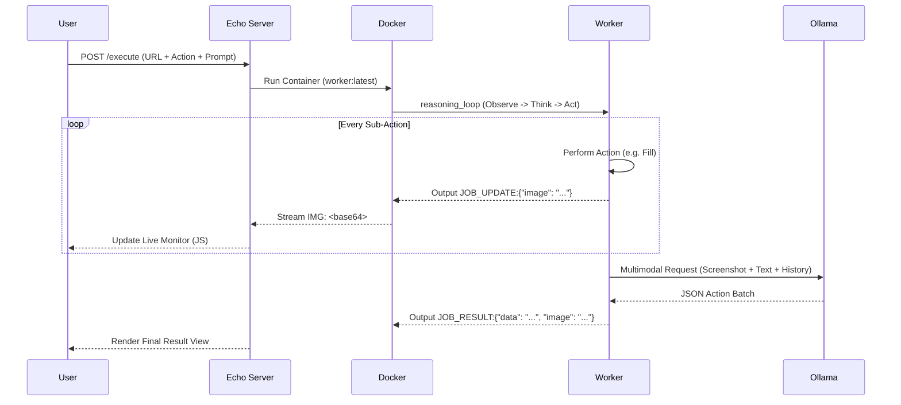

# GEMINI.md

## Project: The "Autonomous Disposable Browser" Execution Engine

**Goal:** A high-performance, isolated system for spawning ephemeral browser environments that act as autonomous agents to perform complex web tasks (scraping, multi-step automation, AI-driven visual analysis) with real-time frame-by-frame feedback.

### 1. The Core Concept

The application serves as an "Autonomous Browser-as-a-Service" gateway.

1.  **Input:** User provides a Target URL, an Action (Scrape, Describe, or AI Action), and an optional custom Prompt.
2.  **Orchestration:** The Go/Echo backend spawns a fresh Docker container.
3.  **Execution:** A specialized Go worker inside the container launches Playwright and enters an autonomous reasoning loop.
4.  **Disposal:** The container self-destructs immediately after task completion or client disconnect (`AutoRemove: true` + Context Monitoring).

### 2. Architecture & Stack Integration

| Component | Technology | Location | Role |
| :--- | :--- | :--- | :--- |
| **Orchestrator** | Go + `moby/client` | `internal/orchestrator/` | Manages container lifecycle and log streaming with protocol decoding. |
| **The Worker** | Playwright-Go + Ollama | `cmd/worker/` | Standalone autonomous agent binary with multimodal capabilities. |
| **The Interface** | Templ + Vanilla JS | `views/execution/` | Interactive UI with real-time frame-by-frame "video" monitor and scrolling logs. |
| **AI Integration** | Ollama (Gemma 3:4b) | External (10.0.0.115) | Brain of the agent; processes screenshots and cleaned text context. |

### 3. Key Features

#### 🧠 Autonomous Agent Loop ("AI Action")
Unlike static scrapers, the `ai_action` engine operates as an iterative agent:
*   **Observe:** Captures high-res screenshots and extracts a "Smart Index" of all visible interactive elements (IDs, Names, Types, and **Current Values**).
*   **Think:** Sends multimodal state to Ollama to determine the next sequence of steps.
*   **Act:** Executes batched actions (fills, clicks, keypresses) in sequence.
*   **Repeat:** Iterates (up to 5 times) until the goal is achieved or a success state (e.g., Dashboard navigation) is detected.

#### 🎥 Real-Time "Video" Streaming
*   **Frame-by-Frame Updates:** The worker emits a fresh screenshot update (`JOB_UPDATE`) after *every single action* (e.g., as soon as a field is filled).
*   **Custom Streaming Protocol:** The backend uses a line-based protocol (`LOG:`, `IMG:`, `END:`) to pipe data.
*   **Zero-Latency UI:** Client-side JS uses the Fetch ReadableStream API to process frames and logs instantly, providing a live view of the browser's "hands" moving on the page.

#### 🛡️ Secure & Optimized Isolation
*   **Zombie Protection:** Orchestrator monitors context cancellation; if the user closes the tab, the Docker container is instantly killed and removed.
*   **Layered Docker Caching:** Playwright driver and Chromium binaries are baked into a dedicated image layer, ensuring sub-second worker startup.
*   **Text-Dense Context:** Automatically strips HTML noise (scripts, styles, SVGs) using in-browser JS evaluation to provide the AI with 10x more relevant context within model token limits.

### 4. Data Flow

### 5. Local Setup

1.  **Build Worker:** `docker build -t worker:latest -f cmd/worker/Dockerfile .`
2.  **Start App:** `go run cmd/main.go`
3.  **Configure AI:** Ensure Ollama is running at `10.0.0.115` with `gemma3:4b` available.
4.  **Execute:** Navigate to `/execution` in your browser.